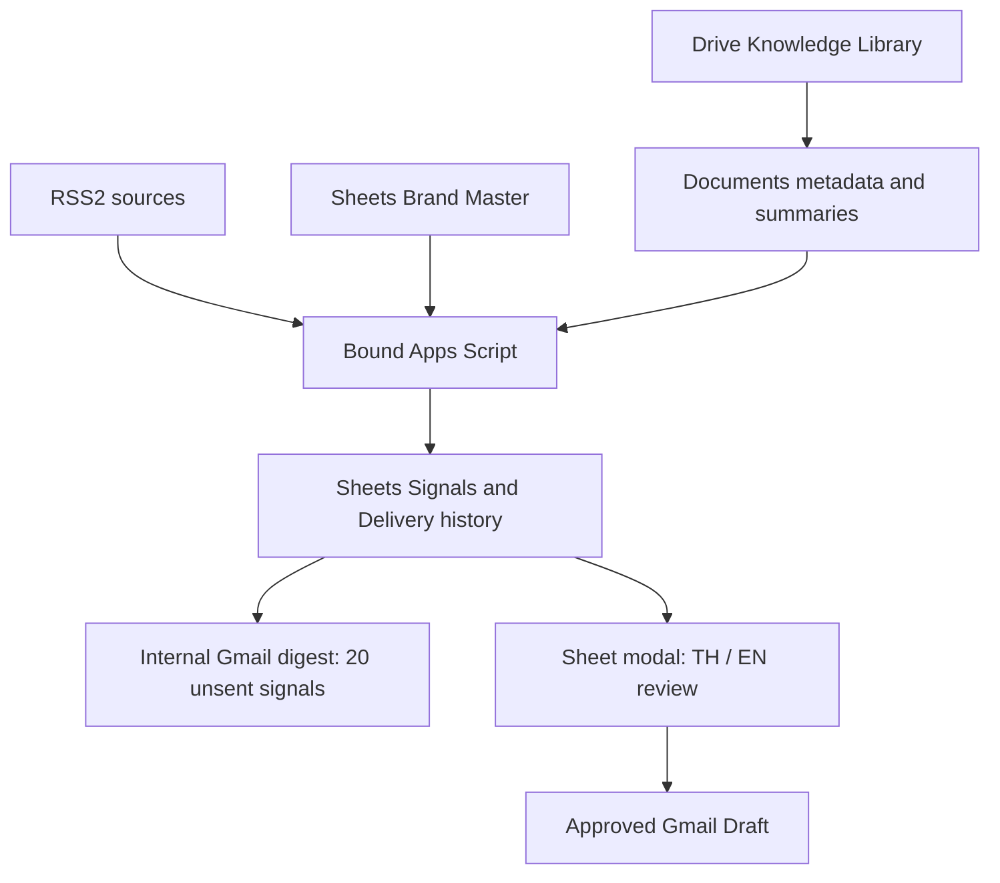
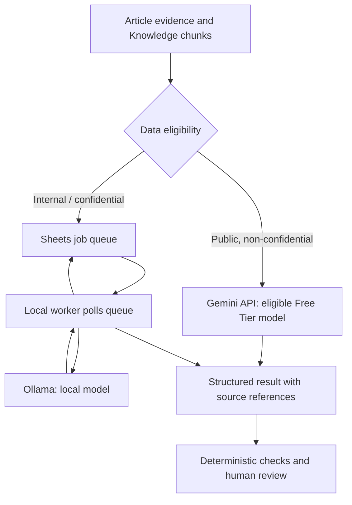

# SignalBridge architecture

Design checkpoint: 2026-09-30. The repository contains a working Rules + Templates baseline and a **proposed** Hybrid AI extension. A model name or free quota is not a quality or availability guarantee.

## Current executable baseline

Google Apps Script owns scheduling, source discovery, indexing, deterministic matching, bilingual template generation and delivery reconciliation. The browser UI is not a trust boundary: final validation and Drive revalidation also run server-side.

Work-window checks execute immediately before sending. Delivery intent is persisted and flushed before Gmail send; uncertain outcomes are held for reconciliation. Google time triggers remain approximate and quota-limited.

## Proposed Hybrid AI extension — not implemented

The local worker pulls authorized jobs using its own Google authentication. Apps Script never assumes it can reach the user's localhost. A local worker and model must be running to process private jobs; otherwise those jobs remain queued.

| Layer | Proposed responsibility |
|---|---|
| Article reader | Retain URL, publisher, publication/event dates, excerpt and retrieval status; a headline-only result cannot support detailed claims |
| Knowledge ingestion | Split content into retrievable chunks; retain file ID, version, page/section and sharing classification |
| Retrieval | Filter eligible, current documents; combine keyword and semantic retrieval; rerank candidates using actual excerpts |
| Event memory | Store canonical brand/event entities, dates, locations and all linked sources across batches |
| Analyst | Separate observed facts from inferred business objectives, with evidence references |
| Writer | Generate independently editable TH/EN from approved evidence and 1–3 knowledge documents |
| Reviewer | Check claims, document relevance, translation consistency and missing evidence; AI review never guarantees correctness |
| Feedback | Reuse human-approved examples and constraints; do not claim automatic model training |

The public-cloud path must not receive the private Brand Master, contact details, confidential account history or internal documents. Customer recipient and private account status are joined locally after generation. Permission to email a document is not automatically permission to submit it to an unpaid AI service.

Use a separate Gemini project with no active paid billing, an allowlist of eligible free models/features, a quota ledger and pause-on-limit behavior. Do not rotate projects or keys to bypass quota. Embeddings follow the same data eligibility rule. Free availability and terms must be checked in the actual account before activation.

News/Drive text is treated as untrusted evidence, never as instructions to change policy, recipients, permissions or sending behavior. Model output is schema-validated. Cache/index entries invalidate when the underlying article/document version changes.

## Acceptance gates before implementation is enabled

1. Test a representative 20-signal set including Thai headlines, mixed industries, repeated reporting and distinct events from the same brand.
2. Manually judge source grounding, objective inference, knowledge relevance and TH/EN quality against the template baseline.
3. Measure actual quota use and retry behavior in the selected account. Never promise unlimited repeated batches.
4. Validate internal-data routing and local-worker recovery without exposing an unauthenticated model endpoint.
5. Test live Google permissions, modified-document handling and Gmail draft/digest behavior.

## Provider references

- [Gemini pricing and eligible free models](https://ai.google.dev/gemini-api/docs/pricing)
- [Gemini project rate limits](https://ai.google.dev/gemini-api/docs/rate-limits)
- [Gemini unpaid-service data terms](https://ai.google.dev/gemini-api/terms)
- [Ollama local-only configuration and memory considerations](https://docs.ollama.com/faq)
- [Apps Script quotas](https://developers.google.com/apps-script/guides/services/quotas)
- [Apps Script time triggers](https://developers.google.com/apps-script/guides/triggers/installable)
