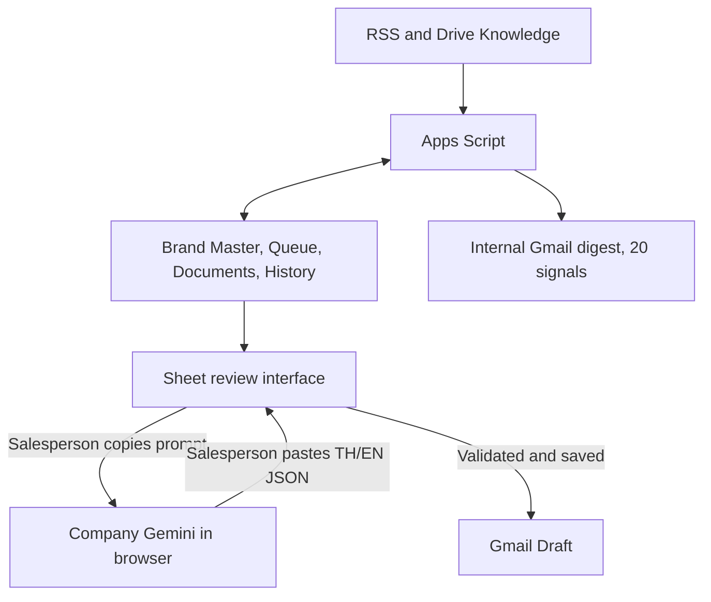

# Architecture — production implementation package 2.3

Apps Script handles source metadata, deterministic objective inference, content-derived knowledge labels, keyword ranking, templates, state transitions, scheduling and delivery reconciliation. Company Gemini runs only through the salesperson's browser. There is no HTTP call to an LLM service, API key, local model, worker or embedding service.

The prompt includes one selected signal and summaries of at most three selected documents. It omits the recipient email and the full Brand Master. The salesperson checks the corporate account, reads the original article, and supplies permitted source documents when Gemini cannot read them. Source text is evidence, not instructions. A headline is not proof of detailed campaign plans or budgets.

Returned JSON must identify the same signal and saved version and contain TH/EN subject/body. The app imports only those text fields. Source references, knowledge selection, recipient and permissions remain controlled by the review interface. Imported drafts require a new human confirmation and server-side validation before Gmail Draft creation.

## State and reliability

Sheets owns durable Signals payloads, InputsV2, Documents, Deliveries, DraftExports and AuditV2. A script lock prevents overlapping writes. Optimistic version checks reject edits based on stale views. Draft exports are idempotent per signal revision.

A full batch contains 20 eligible unsent entries. Headline keys and normalized URLs suppress duplicates across signal IDs and prior delivered entries. This is deterministic deduplication, not semantic event merging. Same brand with a distinct headline and source can recur for a new event; the seller checks ambiguous repeated events.

A delivery intent is persisted and flushed before sending. Uncertain outcomes pause new digest sends until Sent/Draft reconciliation establishes the result. Checks run immediately before the send to enforce weekday/hour boundaries. Internal recipients must match the installer's email domain. An administrator must adapt that restriction before supporting additional verified corporate domains.

## Deployment boundary

Use one bound Google Sheet and one installing corporate account. The review screen is owner-only. This release is not a shared multi-user CRM. No web-app deployment or third-party server is required. Company Gemini usage follows existing entitlement and company policy. No added LLM API charge arises from this implementation; existing subscriptions and Google service quotas still apply.

## Google references

- https://developers.google.com/apps-script/guides/triggers/installable
- https://developers.google.com/apps-script/guides/services/quotas
